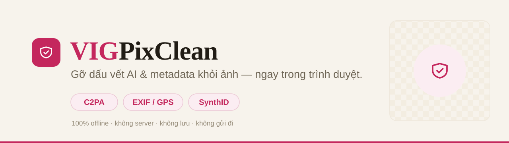

<div align="center">



<br>

**Gỡ dấu vết AI (C2PA / Content Credentials) & metadata khỏi ảnh — xử lý 100% trong trình duyệt.**
Ảnh không rời khỏi máy bạn: không server, không upload, không lưu.

<br>

[](https://github.com/vigdigital/vig-pixclean/stargazers)
[](https://tools.vigdigital.com/pixclean/)
[](#-công-nghệ)
[](#-riêng-tư)

[**▶ Dùng ngay**](https://tools.vigdigital.com/pixclean/) &nbsp;·&nbsp; [Báo lỗi](https://github.com/vigdigital/vig-pixclean/issues) &nbsp;·&nbsp; [vigdigital.com](https://vigdigital.com/)

</div>

---

## 🎯 Vấn đề

Ảnh tạo từ **ChatGPT, Gemini, Firefly, Midjourney…** mang theo chữ ký **C2PA / Content Credentials** khai báo *"tạo bởi AI"*, cùng metadata ẩn (EXIF, GPS, XMP, chú thích). VIG PixClean đọc, chỉ ra và **xoá sạch** chúng — ngay trên trình duyệt.

## ✨ Tính năng

| | |
|---|---|
| 🔍 **Soi sâu cấu trúc file** | Liệt kê mọi thứ ẩn bên trong: C2PA, EXIF, GPS, XMP, IPTC, chú thích (`tEXt`/`iTXt`), comment JPEG… |
| 🏷️ **Nhận diện dấu vết AI** | Gắn nhãn **AI** vs **META**, mô tả rõ nguồn (OpenAI, Google, Adobe…) |
| 🧹 **Xoá metadata (lossless)** | Loại bỏ toàn bộ metadata, **giữ nguyên pixel** — không giảm chất lượng |
| 🎨 **Xử lý lại pixel** | Vẽ & nén lại ảnh để làm mờ watermark ẩn kiểu SynthID nằm trong điểm ảnh |
| 🔒 **100% offline** | Không server, không upload — ảnh xử lý ngay trong trình duyệt |
| 📦 **Không phụ thuộc** | Một file `index.html`, không build, không thư viện |

## ⚙️ Cách hoạt động

Parser đọc trực tiếp cấu trúc nhị phân của file để tìm & loại bỏ chunk/segment metadata:

- **PNG** — giữ `IHDR/PLTE/IDAT/IEND` (+ chunk màu), loại `caBX` (C2PA), `eXIf`, `tEXt/iTXt/zTXt`.
- **JPEG** — loại `APP1` (EXIF/XMP), `APP11` (C2PA/JUMBF), `APP13` (IPTC), `APP14` (Adobe), `COM`.
- **WEBP** — loại chunk `EXIF`/`XMP`, xoá cờ tương ứng trong `VP8X`.

Tuỳ chọn *"xử lý lại pixel"* dùng `<canvas>` re-encode — xoá sạch mọi metadata **và** thay đổi pixel để chống watermark nhúng trong ảnh.

## 🚀 Chạy local

Mở thẳng file:

```bash
open index.html
```

Hoặc chạy như web server:

```bash
python3 -m http.server 8000
# rồi mở http://localhost:8000
```

## 🔒 Riêng tư

Toàn bộ xử lý diễn ra bằng JavaScript **trên máy bạn**. File ảnh **không bao giờ** được gửi lên bất kỳ server nào — không upload, không lưu, không log. Bạn có thể tắt mạng và tool vẫn chạy bình thường.

> **Lưu ý về watermark trong pixel:** xoá metadata gỡ được chữ ký C2PA và thông tin ẩn trong file, nhưng **không** đụng tới watermark nhúng trong điểm ảnh (như SynthID). Muốn giảm loại đó phải *xử lý lại pixel* / resize / chụp lại màn hình — và vẫn không đảm bảo mất hoàn toàn.

## 🧰 Công nghệ

- **HTML5 + CSS3 + JavaScript thuần** (ES6, không framework)
- Không build step, không dependency ngoài (chỉ Google Fonts)
- Toàn bộ trong một file `index.html`

## ⭐ Ủng hộ

Nếu tool hữu ích, **thả cho một sao** ở góc trên bên phải nhé — giúp nhiều người tìm thấy hơn.

---

<div align="center">

Phát triển bởi [**VIG**](https://vigdigital.com/) — Công ty TNHH Truyền Thông Tiếp Thị VIG
<br>
<sub>© 2026 VIG Digital</sub>

</div>
